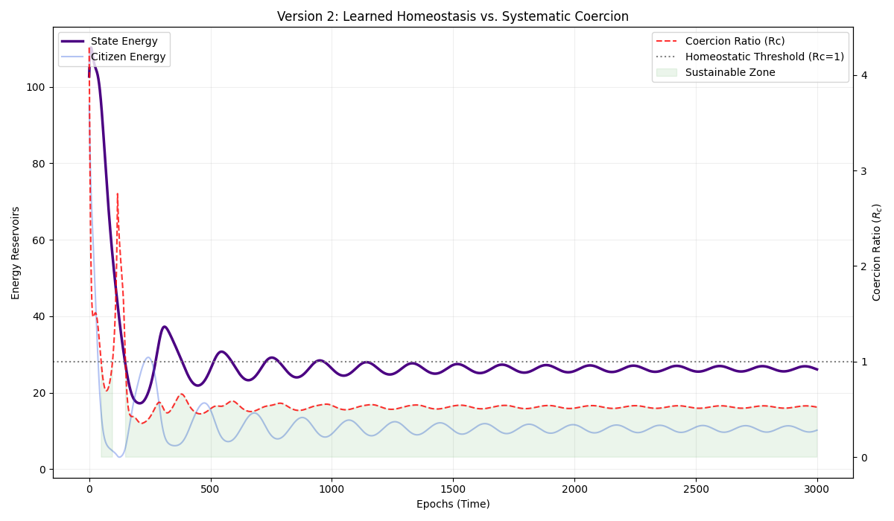

# Entropic RL: The Thermodynamic State (V2) 🌀

### *Where Control Theory meets Social Physics*

[cite_start]This repository implements a **Thermodynamic Reinforcement Learning** system governed by the principles of **Maximum Entropy RL**[cite: 15, 48]. [cite_start]Unlike deterministic models that collapse into "Heat Death," this engine uses an **Agentic State** to learn sustainable extraction policies through the **Coercion Ratio ($R_c$)**[cite: 16, 21].

---

## 💎 The Innovation: The Coercion Ratio ($R_c$)

[cite_start]The "owned innovation" of this project is the **Coercion Ratio ($R_c$)**, a metric that defines the "entropy cost of extraction"[cite: 16, 17]:

$$R_c(t) = \frac{E_{extracted}(t)}{\mathcal{H}_{citizens}(t) + \delta}$$

* [cite_start]**Homeostasis ($R_c < 1.0$):** The State (Agent) extracts value at a rate that allows Citizen Entropy to regenerate[cite: 22, 23].
* **Systemic Collapse ($R_c > 1.0$):** Greed outpaces regrowth, triggering a "Heat Death" where the system loses its "temperature" and eventually fails[cite: 21, 24, 29].

---

## 📊 V2 Results: The Stability Simplex

[cite_start]The current simulation (found in `simulation.py`) tracks the evolution of the State versus the People over 3,000 epochs[cite: 17, 18, 31]. 



### **Observation: Sustainable Tyranny**
* [cite_start]**Epochs 0–500:** The Agent explores high-coercion strategies, causing $R_c$ to spike and Citizen Energy to tank[cite: 22].
* **Epochs 500–3000:** The **Soft Objective** forces the agent to back off. [cite_start]It settles into a "Dystopian Equilibrium" where citizens survive at ~10% energy, but the system remains stable indefinitely[cite: 23, 30].

---

## 🧠 Technical Deep Dive: Soft Actor-Critic Logic

[cite_start]This project utilizes the **Soft Value Function**, which rewards the agent for both success and maintaining systemic diversity (entropy)[cite: 49, 50]:

### 1. The Maximum Entropy Objective
[cite_start]$$J(\pi) = \sum_{t=0}^{T} \mathbb{E} [r(s_t, a_t) + \alpha \mathcal{H}(\pi(\cdot|s_t))]$$ [cite: 57]

### 2. The Reparameterization Trick
To allow backpropagation through stochastic actions, we treat action $a$ as a transformation of noise $\epsilon$:
[cite_start]$$a = f_\theta(s, \epsilon) = \mu_\theta(s) + \sigma_\theta(s) \odot \epsilon$$ [cite: 68]

---

## 🚀 Getting Started

```bash
# Clone and Install
git clone [https://github.com/matt-douglas/entropic-rl](https://github.com/matt-douglas/entropic-rl)
cd entropic-rl
pip install -r requirements.txt

# Run the Agentic Simulation
python3 simulation.py
